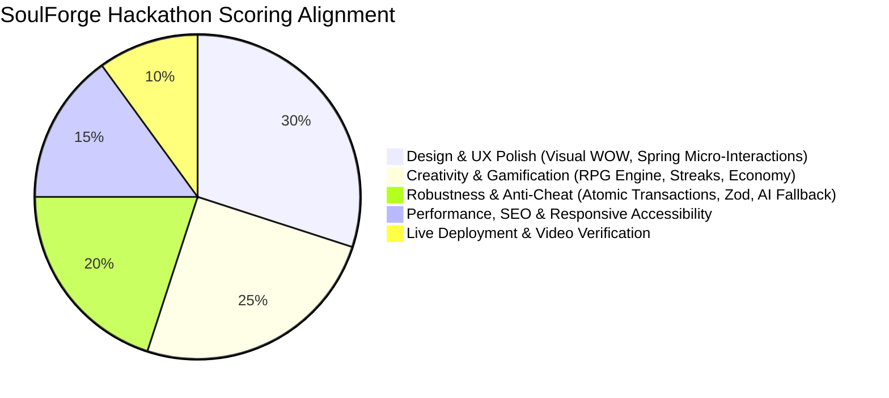

# 00 — Project Context & Hackathon Vision: SoulForge (Life RPG)

## 1. Executive Summary

**SoulForge (Life RPG)** is a full-stack, server-authoritative gamified productivity application engineered for the **Tech Zephyr 4.0 Web Hackathon**.

The application transforms mundane real-world habits, daily chores, academic study, and complex personal goals into an epic virtual role-playing game. Real-world achievements directly translate into **Experience Points (XP)**, **Gold/Coins**, **Attribute Growth** (Intellect, Strength, Discipline, Health, Creativity, Social), **Consecutive Streaks**, **Cosmetic Rewards**, and **Global Leaderboard Rankings**.

Unlike superficial to-do prototypes, SoulForge implements a **hardened, server-authoritative game engine** backed by **PostgreSQL** and an **in-process AI advisor (Google Gemini)**. The frontend never dictates progression math; the server remains the sole arbitrator of truth.

---

## 2. The Core Problem: Delayed Gratification

Modern productivity applications (Todoist, Notion, Apple Reminders, Habitica) often fail long-term users due to the **Delayed Gratification Gap**:
- **Real-World Reality**: Reading a textbook for 3 hours, grinding coding problems, or hitting the gym produces tangible physical and intellectual results only after months or years. In the short term, they feel like pure friction and cognitive fatigue.
- **Gaming Reality**: Video games deliver **instant dopamine loops**—a single monster slain grants immediate floating numbers (+45 XP), audio confirmation, item drops, and visible progression bars.

**SoulForge bridges this gap** by injecting game mechanics into every real-life task, ensuring instant visual, auditory, and mathematical rewards the moment effort is expended.

```
Real-World Action (Study DBMS 2 hrs)
               │
               ▼
   Instant Quest Completion
   ├── +75 Intellect XP (Floating numbers & bar progression)
   ├── +30 Gold Coins (Instant treasury sound & tally)
   ├── +5 Intellect Attribute (Direct character stat increase)
   ├── Streak Advanced (Day 12 / Longest 18)
   └── Level 8 Achieved! (Screen particle burst & title unlock)
```

---

## 3. Creative Direction & Thematic Mandate: "It Needs a Soul"

The official hackathon specification explicitly commands:
> *"This application should not look or feel like a standard enterprise SaaS dashboard or a generic Bootstrap CRUD app. It needs a soul."*

### 3.1 Design Principles
1. **Alive & Tactile**: Every interaction generates physical weight and response. Checking off a task doesn't just toggle a checkbox—it triggers an explosive celebratory sequence (spring animations, screen shake, floating XP indicators, confetti particle bursts).
2. **Thematically Cohesive RPG Terminology**:
   - *Tasks* $\rightarrow$ **Quests / Bounties**
   - *Projects* $\rightarrow$ **Campaigns / Epics**
   - *Points* $\rightarrow$ **Gold / Soul Coins**
   - *Categories* $\rightarrow$ **Attributes / Skill Trees**
   - *Categories mapped*: INTELLECT, STRENGTH, DISCIPLINE, HEALTH, CREATIVITY, SOCIAL
   - *Store* $\rightarrow$ **Armory / Mystic Bazaar**
   - *Profile* $\rightarrow$ **Hero Sheet / Character Tome**
3. **Seamless Remote Integration**: Even though all data is persistently validated on a remote PostgreSQL database, the UI feels as instantaneous as a client-side arcade game through optimistic UI updates, loading skeletons, and smooth micro-transitions.

---

## 4. Disqualification Safeguards & Zero-Tolerance Traps

The hackathon guidelines mandate strict disqualification rules:

| Violation | Hackathon Rule | SoulForge Defense Architecture |
| :--- | :--- | :--- |
| **Fake Data Persistence** | *Immediate zero if app relies solely on localStorage for primary data.* | Full PostgreSQL persistence via Prisma ORM. No game state is stored exclusively in client storage. |
| **Broken Deployment** | *Immediate zero if live link is broken or API fails to connect in production.* | Production-ready configuration with health checks (`/api/health`), Dockerized deployment compatibility (Render/Railway), and robust connection pooling. |
| **Runtime / Console Crashes** | *Immediate zero if unhandled exceptions or blank screens occur during basic usage.* | Centralized Express error handler, Zod validation on every route, and React error boundaries on frontend. |
| **AI Single Point of Failure** | *App crashing when external LLM API times out or fails.* | Resilient **deterministic heuristic classifier fallback** in `taskAnalyzer.ts` ensuring tasks are created seamlessly even if the LLM API is down. |
| **Client Manipulation / Cheating** | *Users altering stats via DevTools or API replay.* | Server-authoritative architecture: XP, coins, attributes, levels, and purchase costs are calculated exclusively on the backend in atomic transactions. |
| **Repository Requirements** | *Must contain clean commit history (>3 commits) and setup instructions.* | Git history, `.env.example`, comprehensive `README.md`, and complete test suite. |
| **Video Requirement** | *Strictly 90–180s screen recording under 100MB demonstrating persistence.* | Dedicated walkthrough script demonstrating: signup $\to$ add task with AI $\to$ complete task $\to$ level up $\to$ buy item $\to$ browser refresh proving DB persistence. |

---

## 5. Hackathon Judging Pillars & Alignment



1. **Design & UX (Crucial Warning)**: Dark fantasy / cyber-mystic aesthetic, bespoke custom design system, Framer Motion springs, canvas confetti, sound effects, responsive typography.
2. **Creativity & Gamification**: Non-linear level formula ($100 \times \text{level}^{1.6}$), 6-dimensional attribute progression, streak shields, achievement triggers, cosmetic equip system.
3. **Robustness & Edge Cases**: 100% server-authoritative, race-condition protected transactions, AI prompt injection resistance, idempotent endpoints.
4. **Performance & Accessibility**: Sub-50ms API responses, indexed database queries, full keyboard navigation (Tab/Enter/Space), semantic HTML.
