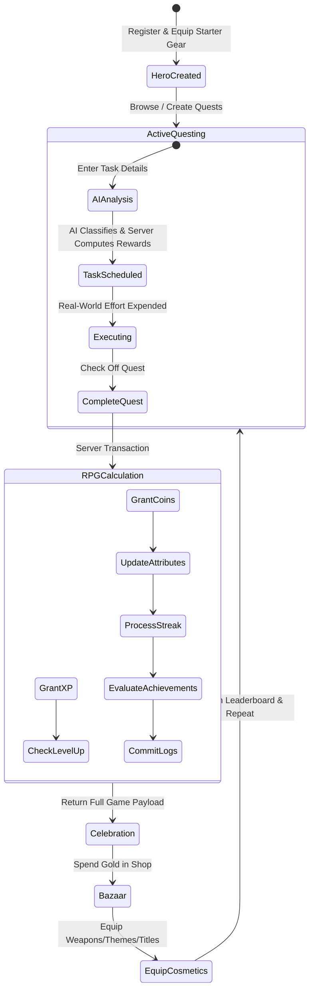

# 01 — Product Specification: SoulForge (Life RPG)

## 1. Product Vision & Personas

SoulForge converts daily human effort into high-stakes RPG progression. The system is designed for ambitious individuals who struggle with task procrastination, burnout, and lack of immediate feedback.

### 1.1 Target Personas
- **The Student / Grinder ("The Mage")**: Studies algorithms, DBMS, system design, and mathematics. Requires high **Intellect** and **Discipline** growth. Needs structured multi-day study campaigns (e.g., "Master Distributed Systems").
- **The Fitness Enthusiast ("The Warrior")**: Tracks gym sessions, running, protein intake, and mobility routines. Focuses on **Strength** and **Health** stats. Motivated by unbroken streaks.
- **The Creative Professional ("The Artisan")**: Writes code, designs UI, composes music, edits videos, or creates content. Cultivates **Creativity** and **Intellect**.
- **The Chronic Procrastinator ("The Wanderer")**: Struggles to start habits. Needs AI Habit Deconstruction to turn daunting goals ("Stop procrastinating", "Fix sleep schedule") into bite-sized micro-quests.

---

## 2. The Core Game Loops

### 2.1 Daily Core Loop (The Bounty Cycle)
1. **Intake**: Player creates a task (e.g., "Implement JWT authentication in Express").
2. **AI Advisory Scan**: AI evaluates difficulty, effort, impact, and category; Server stamps persistent XP and Gold rewards.
3. **Execution & Checkoff**: User completes real-life task and triggers completion.
4. **Immediate Dopamine Response**: 
   - Floating XP particles (`+60 XP (Intellect)`).
   - Coin audio chime and gold counter increase (`+24 Gold`).
   - Progress bar fills smoothly; if threshold reached, full-screen **LEVEL UP!** fanfare modal triggers.
   - Streak counter increments (`Day 7 🔥 Streak Badge Unlocked`).

### 2.2 Macro Loop (Campaigns & Economy)
1. **Campaigns (Projects)**: Players group quests into multi-stage Campaigns (e.g., "Launch Hackathon MVP"). Completing all campaign quests unlocks a massive **Epic Chest** (Bonus XP + Gold).
2. **The Bazaar (Economy)**: Players take hard-earned gold to the shop to buy custom Avatars, Titles, Frames, UI Themes (e.g., Cyberpunk Neon, Eldritch Dark, Lo-Fi Cozy), and Pets.
3. **Social & Hall of Champions**: Players compare weekly XP gains on the global and friends leaderboards.

---

## 3. Complete Feature Breakdown

### 3.1 Authentication & Hero Creation
- **Secure Access**: Email & password authentication with bcrypt (12 rounds) and JWT sessions.
- **Automatic Hero Provisioning**: Every new account is atomically initialized with a Level 1 Character Sheet:
  - Base Stats: 10 across all 6 attributes.
  - Starting Wealth: 0 Gold (or 50 starter bonus).
  - Starter Inventory: Default Adventurer Avatar, Classic SoulForge Theme, "Apprentice" Title.
- **Cross-Device Persistence**: Data persists in PostgreSQL; logging in on mobile or desktop provides immediate synchronization.

### 3.2 Quest Engine (Tasks)
- **CRUD with Server Protection**: Create, view, update metadata (title, notes, due date), and delete quests.
- **Authoritative Attributes**:
  - `Category`: `INTELLECT`, `STRENGTH`, `DISCIPLINE`, `HEALTH`, `CREATIVITY`, `SOCIAL`.
  - `Priority`: `LOW`, `MEDIUM`, `HIGH`, `URGENT`.
  - `Difficulty`: `EASY`, `MEDIUM`, `HARD`, `EPIC`.
  - `Effort`: `LOW`, `MEDIUM`, `HIGH`.
  - `Impact`: `LOW`, `MEDIUM`, `HIGH`.
- **Status Flow**: `PENDING` $\rightarrow$ `IN_PROGRESS` $\rightarrow$ `COMPLETED` (or `CANCELLED`).
- **Idempotent Completion**: Once marked completed, a quest cannot be completed again. Retries are safe and rejected gracefully.

### 3.3 The 6 Character Attributes
Every quest feeds a specific life dimension:

| Attribute | Real-World Activities | In-Game Significance |
| :--- | :--- | :--- |
| **INTELLECT** | Coding, reading, studying DBMS/math, researching, learning languages. | Unlocks scholar titles, magic-themed cosmetics, and research achievements. |
| **STRENGTH** | Weightlifting, calisthenics, intense physical labor, martial arts. | Unlocks warrior avatars, legendary weapons, and strength feats. |
| **DISCIPLINE** | Waking up on time, cold showers, timeblocking, fasting, avoiding junk habits. | Boosts streak resilience, unlocks ascetic monk titles and shields. |
| **HEALTH** | Hydration, 8 hours sleep, nutritious meal prep, stretching, medical care. | Character vitality, paladin cosmetics, regenerative visual effects. |
| **CREATIVITY** | Writing, UI design, music composition, painting, architectural brainstorming. | Bardic themes, custom UI skins, vibrant aura particle trails. |
| **SOCIAL** | Networking, mentoring, catching up with family, community service, public speaking. | Guild master badges, charismatic titles, party buffs. |

### 3.4 Non-Linear Progression (XP & Levels)
- Formula: $\text{Required XP}(L) = \lfloor 100 \times L^{1.6} \rfloor$
- **Level 1 $\rightarrow$ Level 2**: 100 XP
- **Level 2 $\rightarrow$ Level 3**: 303 XP
- **Level 5 $\rightarrow$ Level 6**: 1,319 XP
- **Level 10 $\rightarrow$ Level 11**: 3,981 XP
- **Multi-Level Catch-up**: Completing an epic multi-stage project with huge XP overflow handles recursive level advancements in a single transaction.

### 3.5 Streak Engine & Streak Shields
- **Calendar-Day Calculation**: Compares server UTC/user calendar dates.
  - Active same calendar day: Streak holds steady.
  - Active next consecutive calendar day: `streak += 1`, longest streak updated.
  - Missed a calendar day: Streak resets to 1 (upon new activity).
- **Streak Recovery (The Phoenix Shield)**:
  - Players can spend **50 Gold** to repair a broken streak.
  - Limited to **once every 7 days** via the `StreakRecovery` ledger.

### 3.6 The Bazaar & Virtual Economy
- **Global Catalogue**: Pre-seeded items with varying rarities (`COMMON`, `UNCOMMON`, `RARE`, `EPIC`, `LEGENDARY`).
- **Item Categories**:
  - `AVATAR`: Custom profile pixel/vector hero illustrations.
  - `THEME`: Palette shifts (Cyberpunk, Eldritch Shadow, High Fantasy Gold, Lo-Fi Minimalist).
  - `FRAME`: Glowing animated borders around the hero profile.
  - `TITLE`: Badges like *"The Bug Slayer"*, *"Iron Will"*, *"Grandmaster"*.
  - `PET`: Companion sprites providing visual flair on the dashboard.
- **Server Verification**: The client only sends `itemId`. The server looks up the true cost, validates coin balance in a transaction, deducts coins, and writes to `Inventory`.

### 3.7 AI Guidance (Advisory Services)
- **Quest Analyzer**: Evaluates natural language input to assign category, difficulty, effort, and impact.
- **Campaign Planner**: Generates phased milestones for complex ambitions (e.g., "Build an AI Agent").
- **Habit Deconstruction**: Converts vague self-help resolutions into a 7-day micro-quest chain.
- **Zero-Crash Heuristic Fallback**: If LLM API fails or rate-limits, regex-based keyword heuristics classify the task seamlessly.

### 3.8 Social & Hall of Champions (Leaderboards)
- **Weekly XP Leaderboards**: Resets weekly to give newcomers a fighting chance, preventing old veterans from permanently dominating.
- **Friendships**: Send friend requests, accept/reject, compare stats in a private friends ladder.
- **Privacy First**: Sensitive notes, descriptions, and passwords are never exposed; only public hero stats (name, avatar, level, weekly XP) are shared.

---

## 4. Audio-Visual Feedback & Micro-Interactions Spec

| Event | Visual Micro-Interaction | Auditory Cue | State Transition |
| :--- | :--- | :--- | :--- |
| **Quest Checkoff** | Green burst, strikethrough spring, floating `+XP` & `+Gold` badge | Subtle tactile click & coin clink | Card fades to completed tab with 0.3s slide |
| **Level Up** | Full-screen modal, gold radiant particle burst, level badge bounce | Fanfare trumpet sound effect | Character sheet bar resets and flashes new level |
| **Streak Increase** | Flame icon ignites, flame particle effect around streak badge | Subtle flame whoosh sound | Counter ticks up with spring scale animation |
| **Shop Purchase** | Item card unlocks with golden border shine, coin counter drops | Cash register / chest open chime | "Equip" button appears immediately |
| **Streak Recovery** | Golden phoenix flame rebirth animation | Chime of resurrection | Streak counter restored to previous high |
