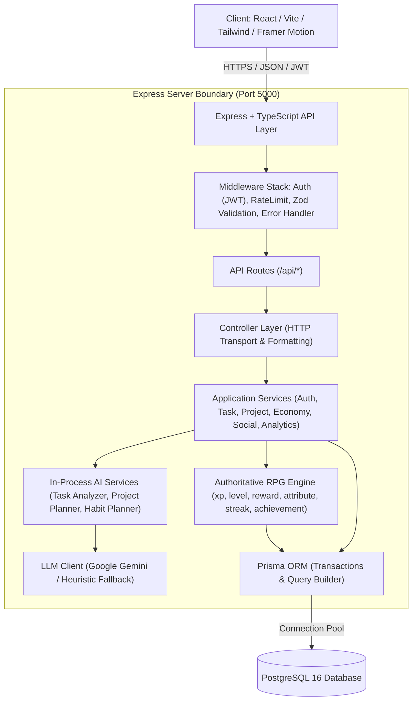

# 02 — System Architecture: SoulForge (Life RPG)

## 1. High-Level System Architecture

SoulForge adheres to a **Client-Server, Domain-Driven, Layered Architecture** with strict server-authoritative state management.



---

## 2. Layered Separation of Concerns

Business logic is strictly isolated from HTTP transports:

```
[ HTTP Request ]
       │
       ▼
1. Route Layer          -> Mounts paths, applies route-specific rate limits and auth guards
       │
       ▼
2. Validation Layer     -> Zod schemas validate req.body, req.params, and req.query
       │
       ▼
3. Controller Layer     -> Extracts req.user.id, formats request parameters, calls services, sets HTTP status codes
       │
       ▼
4. Service Layer        -> Orchestrates business use-cases, permissions, and data assembly
       │
       ▼
5. Domain / RPG Engine  -> Pure mathematical and game rules (XP calculation, streak rules, leveling loops, deterministic rewards)
       │
       ▼
6. Database Layer       -> Prisma Client executes ACID transactions and atomic updates on PostgreSQL
       │
       ▼
[ HTTP Response ]       -> Standardized envelope: { success: true, data: { ... } }
```

### Invariant Rules
- **Controllers never call Prisma directly**: All database queries must go through service or domain methods.
- **Routes never contain logic**: Routes only bind URL paths and HTTP verbs to middleware and controller functions.
- **No Client-Supplied Progression**: The client cannot supply `xp`, `coins`, `level`, `attributeValues`, `rewardAmount`, `itemPrice`, or `completedAt`.

---

## 3. The Central RPG Transaction Orchestrator (`completeTask`)

Task completion is the single most critical transaction in the entire system. If any step fails, the entire transaction rolls back cleanly.

```mermaid
sequenceDiagram
    autonumber
    actor Client as Frontend Client
    participant Controller as TaskController
    participant Orchestrator as RPGService (completeTask)
    participant Engine as RPG Engine Modules
    participant DB as PostgreSQL (Prisma $transaction)

    Client->>Controller: POST /api/tasks/:id/complete (Bearer JWT)
    Controller->>Orchestrator: completeTask(userId, taskId)
    
    rect rgb(20, 25, 45)
        note over Orchestrator,DB: BEGIN TRANSACTION (ISOLATION: SERIALIZABLE / READ COMMITTED)
        Orchestrator->>DB: Fetch Task WHERE id = taskId AND userId = userId
        alt Task Not Found
            Orchestrator-->>Controller: Throw 404 (TASK_NOT_FOUND)
        else Task Already Completed
            Orchestrator-->>Controller: Throw 400 (TASK_ALREADY_COMPLETED)
        end
        
        Orchestrator->>DB: UPDATE Task SET status = 'COMPLETED', completedAt = NOW()
        Orchestrator->>DB: Fetch Character WHERE userId = userId
        
        Orchestrator->>Engine: applyXP(character.level, character.xp, task.xpReward)
        Engine-->>Orchestrator: { newLevel, newXP, leveledUp, oldLevel }
        
        Orchestrator->>Engine: updateAttribute(character, task.category, task.difficulty)
        Engine-->>Orchestrator: { attributeName, attributeIncrease, newAttributes }
        
        Orchestrator->>Engine: processStreak(character.lastActiveDate, character.currentStreak, character.longestStreak)
        Engine-->>Orchestrator: { currentStreak, longestStreak, streakUpdated }
        
        Orchestrator->>DB: UPDATE Character (level, xp, coins + task.coinReward, attributes, streaks)
        
        Orchestrator->>DB: INSERT ActivityLog (type: 'TASK_COMPLETED', xpChange, coinChange, metadata)
        opt Leveled Up
            Orchestrator->>DB: INSERT ActivityLog (type: 'LEVEL_UP', metadata: { oldLevel, newLevel })
        end
        
        Orchestrator->>Engine: checkAchievements(tx, userId, event: 'TASK_COMPLETED')
        Engine->>DB: INSERT UserAchievement (if new unlock) & INSERT ActivityLog
        
        opt Belongs to Project
            Orchestrator->>DB: Recalculate Project Progress (completedTasks / totalTasks)
        end
        
        note over Orchestrator,DB: COMMIT TRANSACTION
    end
    
    Orchestrator-->>Controller: Full Game State Payload
    Controller-->>Client: HTTP 200 { success: true, data: { task, rewards, character, levelUp, streak, achievementsUnlocked } }
```



---

## 4. In-Process AI Architecture

The AI subsystem lives directly inside Express under `src/services/ai/`. This eliminates microservice latency, container overhead, and cross-service authentication hurdles while preserving clean modular boundaries.

```
src/services/ai/
├── aiClient.ts         # Singleton Google Gemini SDK wrapper with timeout & exception shield
├── taskAnalyzer.ts     # Natural language task decomposition & category classification
├── projectPlanner.ts   # Phased campaign generator from high-level objectives
├── habitPlanner.ts     # 7-day micro-quest generator for habit transformation
└── fallback.ts         # Heuristic keyword and regex classifier (guarantees zero downtime)
```

### Advisory Flow
```
User Input ("Study Distributed Systems for 2 hours")
                         │
                         ▼
                 [ Task Analyzer ]
                         │
        ┌────────────────┴────────────────┐
        ▼                                 ▼
[ Gemini LLM API ]              [ Heuristic Fallback ]
(Available & Valid)           (If LLM Fails / No API Key)
        │                                 │
        └────────────────┬────────────────┘
                         ▼
      Validated Classification JSON (Zod)
      - Category: INTELLECT
      - Difficulty: HARD
      - Effort: HIGH
      - Impact: HIGH
                         │
                         ▼
        [ Authoritative Reward Engine ]
       * Base XP: 60
       * Multipliers: x1.5 (Effort) + 15 (Impact)
       * Final Output: XP = 105, Gold = 42
                         │
                         ▼
           Persisted to PostgreSQL
```

---

## 5. Production Deployment Architecture

```mermaid
graph LR
    subgraph "Vercel / Netlify Edge"
        Frontend["React SPA (Vite / Tailwind / Assets)"]
    end

    subgraph "Railway / Render / AWS Cloud"
        APIService["Node.js / Express Container (Docker / PM2)"]
        PostgresDB[("Managed PostgreSQL 16 DB")]
    end

    Frontend -->|HTTPS API Requests| APIService
    APIService -->|Internal Network / Pooling| PostgresDB
    APIService -->|External API (TLS)| GeminiAPI["Google Gemini API"]
```

### Deployment Configuration
- **Process Manager**: Docker container running Node.js with built JavaScript (`dist/server.js`).
- **Connection Pooling**: Prisma connection pool managed with `connection_limit` tuned to database plan.
- **Environment Isolation**: Production environment variables configured through platform secrets (`DATABASE_URL`, `JWT_SECRET`, `LLM_API_KEY`, `FRONTEND_URL`, `PORT`).
- **Zero-Downtime Migration**: Database migrations executed automatically via `prisma migrate deploy` before process boot.
