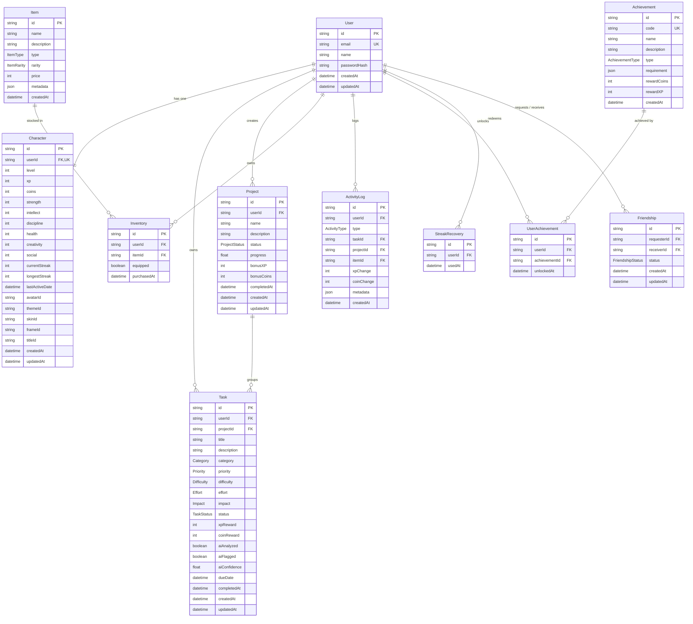

# 04 — Database Architecture & Schema: SoulForge (Life RPG)

## 1. Entity-Relationship (ER) Diagram



---

## 2. Complete Prisma Schema (`schema.prisma`)

```prisma
datasource db {
  provider = "postgresql"
  url      = env("DATABASE_URL")
}

generator client {
  provider = "prisma-client-js"
}

// ==========================================
// ENUMS
// ==========================================

enum Category {
  INTELLECT
  STRENGTH
  DISCIPLINE
  HEALTH
  CREATIVITY
  SOCIAL
}

enum Priority {
  LOW
  MEDIUM
  HIGH
  URGENT
}

enum Difficulty {
  EASY
  MEDIUM
  HARD
  EPIC
}

enum Effort {
  LOW
  MEDIUM
  HIGH
}

enum Impact {
  LOW
  MEDIUM
  HIGH
}

enum TaskStatus {
  PENDING
  IN_PROGRESS
  COMPLETED
  CANCELLED
}

enum ProjectStatus {
  ACTIVE
  COMPLETED
  ON_HOLD
  CANCELLED
}

enum ItemType {
  AVATAR
  THEME
  SKIN
  WEAPON
  PET
  BACKGROUND
  FRAME
  TITLE
  EFFECT
}

enum ItemRarity {
  COMMON
  UNCOMMON
  RARE
  EPIC
  LEGENDARY
}

enum ActivityType {
  TASK_CREATED
  TASK_COMPLETED
  TASK_DELETED
  PROJECT_CREATED
  PROJECT_COMPLETED
  XP_GAINED
  LEVEL_UP
  ITEM_PURCHASED
  ITEM_EQUIPPED
  STREAK_STARTED
  STREAK_INCREASED
  STREAK_BROKEN
  STREAK_RECOVERED
  ACHIEVEMENT_UNLOCKED
}

enum FriendshipStatus {
  PENDING
  ACCEPTED
  REJECTED
  BLOCKED
}

enum AchievementType {
  TASK
  STREAK
  LEVEL
  PROJECT
  ECONOMY
}

// ==========================================
// MODELS
// ==========================================

model User {
  id           String   @id @default(cuid())
  email        String   @unique
  name         String
  passwordHash String
  createdAt    DateTime @default(now())
  updatedAt    DateTime @updatedAt

  character         Character?
  tasks             Task[]
  projects          Project[]
  inventory         Inventory[]
  activityLogs      ActivityLog[]
  userAchievements  UserAchievement[]
  streakRecoveries  StreakRecovery[]
  sentFriendships   Friendship[]      @relation("SentFriendships")
  receivedFriendships Friendship[]    @relation("ReceivedFriendships")

  @@index([email])
}

model Character {
  id             String    @id @default(cuid())
  userId         String    @unique
  user           User      @relation(fields: [userId], references: [id], onDelete: Cascade)
  
  level          Int       @default(1)
  xp             Int       @default(0)
  coins          Int       @default(50)
  
  // Attributes
  strength       Int       @default(10)
  intellect      Int       @default(10)
  discipline     Int       @default(10)
  health         Int       @default(10)
  creativity     Int       @default(10)
  social         Int       @default(10)
  
  // Streaks
  currentStreak  Int       @default(0)
  longestStreak  Int       @default(0)
  lastActiveDate DateTime?
  
  // Equipped Cosmetics
  avatarId       String?   @default("avatar_starter")
  themeId        String?   @default("theme_classic")
  skinId         String?
  frameId        String?
  titleId        String?   @default("title_apprentice")
  
  createdAt      DateTime  @default(now())
  updatedAt      DateTime  @updatedAt

  @@index([userId])
}

model Task {
  id           String     @id @default(cuid())
  userId       String
  user         User       @relation(fields: [userId], references: [id], onDelete: Cascade)
  
  projectId    String?
  project      Project?   @relation(fields: [projectId], references: [id], onDelete: SetNull)
  
  title        String
  description  String?
  category     Category   @default(INTELLECT)
  priority     Priority   @default(MEDIUM)
  difficulty   Difficulty @default(MEDIUM)
  effort       Effort     @default(MEDIUM)
  impact       Impact     @default(MEDIUM)
  status       TaskStatus @default(PENDING)
  
  xpReward     Int        @default(25)
  coinReward   Int        @default(10)
  
  aiAnalyzed   Boolean    @default(false)
  aiFlagged    Boolean    @default(false)
  aiConfidence Float?
  
  dueDate      DateTime?
  completedAt  DateTime?
  createdAt    DateTime   @default(now())
  updatedAt    DateTime   @updatedAt

  activityLogs ActivityLog[]

  @@index([userId])
  @@index([userId, status])
  @@index([projectId])
  @@index([createdAt])
}

model Project {
  id          String        @id @default(cuid())
  userId      String
  user        User          @relation(fields: [userId], references: [id], onDelete: Cascade)
  
  name        String
  description String?
  status      ProjectStatus @default(ACTIVE)
  progress    Float         @default(0.0)
  
  bonusXP     Int           @default(100)
  bonusCoins  Int           @default(50)
  
  completedAt DateTime?
  createdAt   DateTime      @default(now())
  updatedAt   DateTime      @updatedAt

  tasks        Task[]
  activityLogs ActivityLog[]

  @@index([userId])
  @@index([userId, status])
}

model Item {
  id          String     @id @default(cuid())
  name        String
  description String
  type        ItemType
  rarity      ItemRarity @default(COMMON)
  price       Int
  metadata    Json?
  createdAt   DateTime   @default(now())

  inventories  Inventory[]
  activityLogs ActivityLog[]

  @@index([type])
  @@index([rarity])
}

model Inventory {
  id          String   @id @default(cuid())
  userId      String
  user        User     @relation(fields: [userId], references: [id], onDelete: Cascade)
  
  itemId      String
  item        Item     @relation(fields: [itemId], references: [id], onDelete: Restrict)
  
  equipped    Boolean  @default(false)
  purchasedAt DateTime @default(now())

  @@unique([userId, itemId])
  @@index([userId])
  @@index([itemId])
}

model ActivityLog {
  id         String       @id @default(cuid())
  userId     String
  user       User         @relation(fields: [userId], references: [id], onDelete: Cascade)
  
  type       ActivityType
  
  taskId     String?
  task       Task?        @relation(fields: [taskId], references: [id], onDelete: SetNull)
  
  projectId  String?
  project    Project?     @relation(fields: [projectId], references: [id], onDelete: SetNull)
  
  itemId     String?
  item       Item?        @relation(fields: [itemId], references: [id], onDelete: SetNull)
  
  xpChange   Int          @default(0)
  coinChange Int          @default(0)
  metadata   Json?
  
  createdAt  DateTime     @default(now())

  @@index([userId, createdAt])
  @@index([userId, type])
}

model Friendship {
  id          String           @id @default(cuid())
  requesterId String
  requester   User             @relation("SentFriendships", fields: [requesterId], references: [id], onDelete: Cascade)
  
  receiverId  String
  receiver    User             @relation("ReceivedFriendships", fields: [receiverId], references: [id], onDelete: Cascade)
  
  status      FriendshipStatus @default(PENDING)
  createdAt   DateTime         @default(now())
  updatedAt   DateTime         @updatedAt

  @@unique([requesterId, receiverId])
  @@index([requesterId])
  @@index([receiverId])
}

model Achievement {
  id          String          @id @default(cuid())
  code        String          @unique
  name        String
  description String
  type        AchievementType
  requirement Json
  rewardCoins Int             @default(50)
  rewardXP    Int             @default(100)
  createdAt   DateTime        @default(now())

  userAchievements UserAchievement[]
}

model UserAchievement {
  id            String      @id @default(cuid())
  userId        String
  user          User        @relation(fields: [userId], references: [id], onDelete: Cascade)
  
  achievementId String
  achievement   Achievement @relation(fields: [achievementId], references: [id], onDelete: Cascade)
  
  unlockedAt    DateTime    @default(now())

  @@unique([userId, achievementId])
  @@index([userId])
}

model StreakRecovery {
  id     String   @id @default(cuid())
  userId String
  user   User     @relation(fields: [userId], references: [id], onDelete: Cascade)
  usedAt DateTime @default(now())

  @@index([userId, usedAt])
}
```

---

## 3. Database Performance & Indexing Rationale

1. **User Lookups**: `User.email` has a unique B-Tree index for $O(1)$ login queries.
2. **Dashboard Query Optimization**:
   - `Task(userId, status)` composite index enables instant filtering of pending quests for the current user without full table scans.
   - `ActivityLog(userId, createdAt)` composite index allows sub-millisecond retrieval of the user's latest 10 events.
3. **Cosmetic Inventory Ownership**:
   - `Inventory(userId, itemId)` unique constraint prevents accidental duplicate purchases of the same unique cosmetic item at the database level.
4. **Referential Integrity**:
   - Deleting a task sets `taskId = null` in `ActivityLog` (`onDelete: SetNull`), guaranteeing historical reward audit integrity is never lost.
