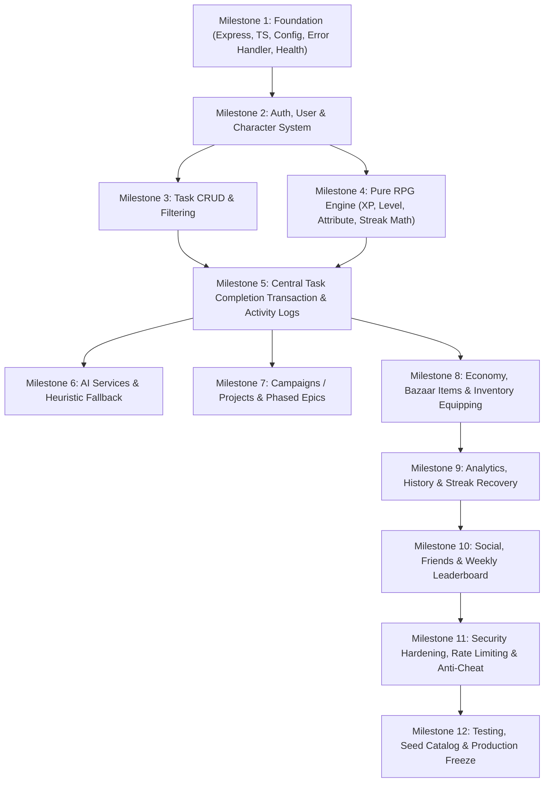

# 09 — Engineering Roadmap & Milestones: SoulForge (Life RPG)

## 1. Implementation Dependency Graph

To guarantee stability, the backend is engineered in a strict dependency sequence:

---

## 2. Detailed Milestone Breakdown

### Milestone 1: Foundation & Infrastructure
- Initialize `server/` with TypeScript, Express, Helmet, CORS, dotenv.
- Centralized error middleware with standardized `{ success, data/error }` envelopes.
- Setup `src/config/env.ts` with Zod schema validation.
- Implement and verify `GET /api/health`.

### Milestone 2: Identity & Hero Provisioning
- Implement Prisma schema for `User` and `Character`.
- Setup bcrypt password hashing and JWT token generation.
- Implement `POST /api/auth/register` (atomically creates User + Level 1 Character).
- Implement `POST /api/auth/login` and `GET /api/auth/me`.
- Implement `auth.middleware.ts` verifying Bearer tokens.

### Milestone 3: Task Management & Filtering
- Implement `Task` Prisma model with Category, Priority, Difficulty, Effort, Impact, and Status enums.
- Implement Task CRUD: `GET /api/tasks`, `POST /api/tasks`, `PATCH /api/tasks/:id`, `DELETE /api/tasks/:id`.
- Ensure strict ownership filters (`WHERE userId = req.user.id`).

### Milestone 4: Pure RPG Engine (Domain Logic)
- Implement `src/services/rpg/`:
  - `xp.service.ts`: Formula $100 \times L^{1.6}$.
  - `level.service.ts`: Multi-level advancement algorithm.
  - `reward.service.ts`: Deterministic reward calculation.
  - `attribute.service.ts`: Stat growth mapping for the 6 life attributes.
  - `streak.service.ts`: Calendar-day streak evaluation.
- Write isolated unit tests verifying mathematical correctness.

### Milestone 5: Central Task Completion Transaction
- Implement `completeTask(userId, taskId)` orchestrator in `src/services/rpg/rpg.service.ts`.
- Wrap in ACID `prisma.$transaction`:
  1. Status check (prevents double completion).
  2. Mark task completed.
  3. Apply XP and Gold.
  4. Advance attributes.
  5. Process streaks.
  6. Evaluate and unlock achievements.
  7. Write `ActivityLog` records.
- Return full celebration payload for frontend.

### Milestone 6: AI Services & Heuristic Fallback
- Implement `src/services/ai/aiClient.ts` with Google Gemini SDK.
- Implement `taskAnalyzer.ts` extracting category, priority, difficulty, effort, impact.
- Implement `fallback.ts` using regex keyword classification for 100% offline resilience.
- Wire AI analysis into `POST /api/tasks` and expose `POST /api/ai/tasks/analyze`.

### Milestone 7: Campaigns & Projects
- Implement `Project` Prisma model with tasks relation.
- Implement Project CRUD: `GET /api/projects`, `POST /api/projects`, `PATCH /api/projects/:id`.
- Implement `POST /api/projects/:id/complete` with campaign bonus validation.
- Implement `projectPlanner.ts` for AI-assisted multi-phase campaign generation.

### Milestone 8: Virtual Economy & Armory
- Implement `Item` and `Inventory` Prisma models.
- Implement `GET /api/items` (Shop catalogue) and `GET /api/inventory` (User items).
- Implement `POST /api/items/:id/purchase` with atomic balance validation.
- Implement `POST /api/inventory/:id/equip` with slot replacement logic.

### Milestone 9: Analytics, Audit Trail & Streak Recovery
- Implement `GET /api/activity` with pagination.
- Implement `GET /api/analytics/overview`, `/xp`, `/attributes`, `/records`.
- Implement `POST /api/streak/recover` (The Phoenix Shield) with 50 coin cost and 7-day cooldown.

### Milestone 10: Social, Friends & Hall of Champions
- Implement `Friendship` Prisma model.
- Implement friend requests: `POST /request`, `POST /accept`, `POST /reject`, `GET /friends`.
- Implement `GET /api/leaderboard/global` (weekly XP) and `GET /api/leaderboard/friends`.
- Implement `GET /api/users/search` (sanitized public profiles).

### Milestone 11: Security & Anti-Cheat Hardening
- Implement rate limiting middleware (Auth, AI, Global).
- Add parameter stripping in Zod schemas.
- Implement double-completion and concurrent purchase stress tests.

### Milestone 12: Catalogue Seeding, Testing & Verification
- Implement `prisma/seed.ts` with 15+ cosmetic items and 10+ achievements.
- Run complete test suite (Auth, Tasks, RPG math, Transactions, Economy, AI fallback).
- Build production bundle (`npm run build`).
- Complete live deployment verification and walkthrough video preparation.
