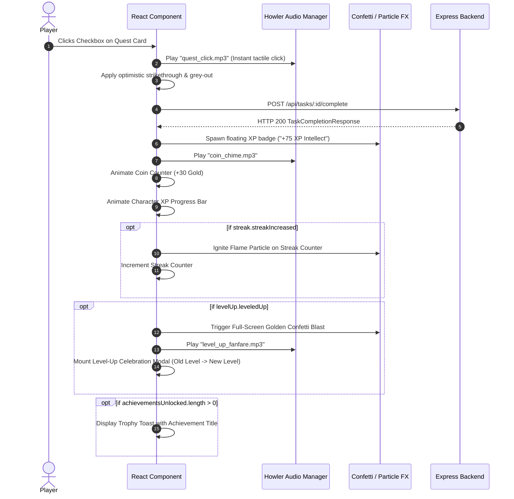

# 14 — Frontend-Backend Integration Contract: SoulForge (Life RPG)

## 1. Integration Philosophy

To fulfill the hackathon mandate:
> *"The UI should react instantly to the user... Even though data is stored on a remote server, the user should never feel bogged down by network latency. Utilize loading skeletons, optimistic UI updates, and smooth transitions."*

The frontend and backend coordinate through a **strict contract** where:
1. The frontend manages immediate tactile micro-interactions (checkbox animation, initial particle puff).
2. The backend responds with the authoritative celebration payload.
3. The frontend executes the full celebration sequence (XP floaters, level-up modal, fanfare audio) once the server payload arrives.

---

## 2. The Celebration Event Contract (`POST /api/tasks/:id/complete`)

When a quest is completed, the backend returns everything required for the UI celebration in a single JSON payload:

```typescript
interface TaskCompletionResponse {
  success: true;
  data: {
    task: {
      id: string;
      status: 'COMPLETED';
      completedAt: string;
    };
    rewards: {
      xp: number;                 // e.g. 75
      coins: number;              // e.g. 30
      attribute: Category;        // 'INTELLECT' | 'STRENGTH' | 'DISCIPLINE' | 'HEALTH' | 'CREATIVITY' | 'SOCIAL'
      attributeIncrease: number;  // e.g. 5
    };
    character: {
      level: number;
      xp: number;
      nextLevelXP: number;
      coins: number;
      intellect: number;
      strength: number;
      discipline: number;
      health: number;
      creativity: number;
      social: number;
    };
    levelUp: {
      leveledUp: boolean;
      oldLevel: number;
      newLevel: number;
    };
    streak: {
      current: number;
      longest: number;
      streakIncreased: boolean;
    };
    achievementsUnlocked: Array<{
      id: string;
      code: string;
      name: string;
      description: string;
      rewardCoins: number;
      rewardXP: number;
    }>;
  };
}
```

---

## 3. Frontend Celebration Orchestration Sequence



---

## 4. Optimistic UI & Error Rollback Guidelines

If the network drops or the server rejects completion (e.g., task was already completed or server returned 500):
1. The frontend catches the error.
2. The optimistic strikethrough is removed.
3. The task is restored to its `PENDING` state on screen.
4. A red toast appears: *"Could not complete quest. Changes rolled back."*

---

## 5. Cosmetic & Theme Rendering Contracts

Equipped cosmetic IDs correspond to predefined frontend asset tokens:

| Slot | ID Prefix | Example | Frontend Rendering Behavior |
| :--- | :--- | :--- | :--- |
| `avatarId` | `avatar_*` | `avatar_cyber_ninja` | Renders the SVG / WebP sprite in hero frame and leaderboard |
| `themeId` | `theme_*` | `theme_neon_dungeon` | Switches the root CSS variables (background, neon accent, borders) |
| `frameId` | `frame_*` | `frame_golden_dragon` | Overlays an animated SVG border around the hero avatar |
| `titleId` | `title_*` | `title_grandmaster` | Renders a glowing styled badge underneath the hero's name |

---

## 6. Standardized Error Codes & User Messages

| Error Code | HTTP Status | Frontend Friendly Message |
| :--- | :---: | :--- |
| `TASK_NOT_FOUND` | 404 | "Quest not found or has already been removed." |
| `TASK_ALREADY_COMPLETED` | 400 | "This quest was already completed! Rewards were already recorded." |
| `INSUFFICIENT_COINS` | 400 | "You need more gold to purchase this item from the Armory." |
| `ITEM_ALREADY_OWNED` | 409 | "You already own this unique cosmetic item." |
| `STREAK_NOT_BROKEN` | 400 | "Your streak is still active! No recovery needed." |
| `COOLDOWN_ACTIVE` | 400 | "Phoenix Shield is recharging. Streak recovery available once every 7 days." |
| `INVALID_CREDENTIALS` | 401 | "Invalid email or master password. Please check your credentials." |
| `EMAIL_ALREADY_EXISTS` | 409 | "A hero with this email already exists in SoulForge." |
| `RATE_LIMIT_EXCEEDED` | 429 | "Too many requests. Please catch your breath for a minute." |
| `INTERNAL_SERVER_ERROR` | 500 | "A server error occurred. The scribe is investigating." |
